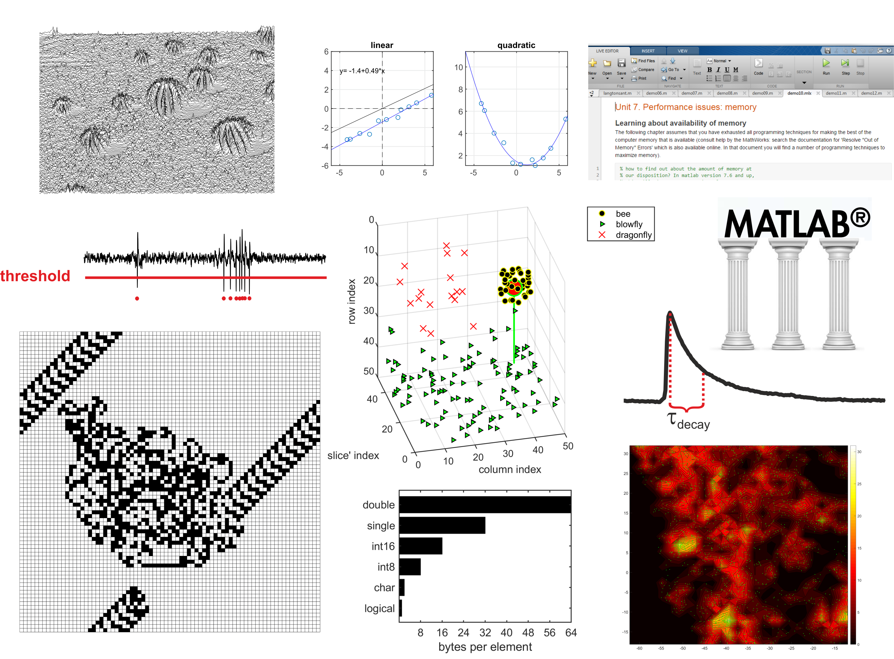

# Introduction to Matlab

This repo contains teaching material for past incarnations of the 'Introduction to Matlab' course at the Graduate Training Center of Neuroscience, University of Tuebingen/International Max Planck Research School. It has been developed and used by Harald Hentschke 2002-2018. For an overview of topics, see abstract below or syllabus_mcourse.pdf.

### Abstract
The course is intended for programming beginners and will therefore cover basic topics. There is a certain focus on data analysis, but in general, the goal is to understand key concepts of programming in general and Matlab in particular. Accordingly, the course will introduce elements common to all programming languages (e.g. variables and operators, data types, control flow, file input/output) and point to techniques and concepts specific to Matlab. These include scalar expansion, logical subscripting, reshaping and other high-level manipulation of arrays, high-level graphics commands, scripts vs. functions, speed and memory issues, graphical user interfaces. Furthermore, a selected range of programming environment tools like the profiler, help and debugging capabilities of Matlab will be presented. Lectures will be interspersed with practice periods for which exercises including solutions are provided. The students are required to work on a programming project (in teams of two or singly) and present it on the last course day.